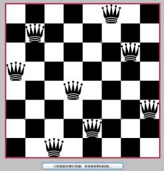

# 八皇后问题 Eight queens

是由国际西洋棋棋手马克斯·贝瑟尔于1848年提出的问题，
是回溯算法的典型案例。

在8×8格的国际象棋上摆放8个皇后，使其不能互相攻击，
即任意两个皇后都不能处于同一行、同一列或同一斜线上，问有多少种摆法。
高斯认为有76种方案。1854年在柏林的象棋杂志上不同的作者发表了40种不同的解，
后来有人用图论的方法解出92种结果。如果经过±90度、±180度旋转，和对角线对称变换的摆法看成一类，
共有42类。计算机发明后，有多种计算机语言可以编程解决此问题。

